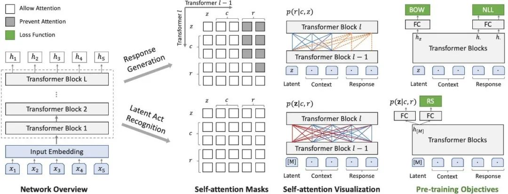
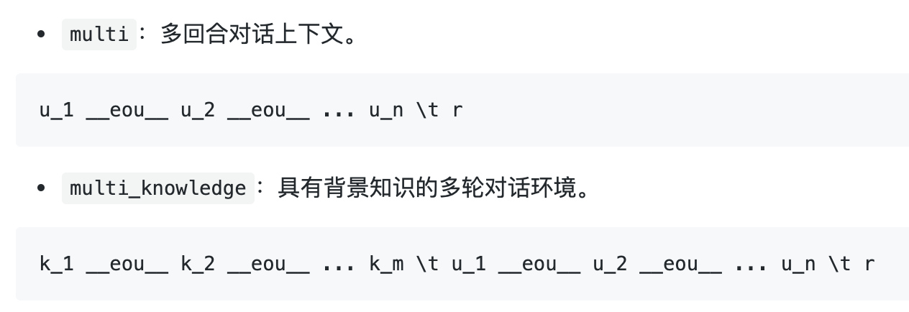

https://mp.weixin.qq.com/s/RD2bd4JT2-9pu435oDbvDg 

百度11篇论文被国际自然语言处理顶级会议ACL 2020录用

百度NLP

2. PLATO: Pre-trained Dialogue  GenerationModel with Discrete Latent Variable

PLATO：具有离散潜变量的预训练对话生成模型



Release our baseline model PLATO w/o latent.

研发开放领域（Open-Domain）的对话机器人，使得它能用自然语言与人自由地交流，一直是自然语言处理领域的终极目标之一。

对话系统的挑战非常多，其中有两点非常重要，一是大规模开放域多轮对话数据匮乏；二是对话中涉及常识、领域知识和上下文，一个对话的上文（Context），往往可以对应多个不同回复（Response）的方向。

PLATO 首次提出将离散的隐变量结合Transformer结构，应用到通用对话领域。通过引入离散隐变量，可以对上文与回复之间的“一对多”关系进行有效建模。

同时，通过利用大规模的与人人对话类似的语料，包括 Reddit 和 Twitter，进行了生成模型的预训练，后续在有限的人人对话语料上进行微调，即可以取得高质量的生成效果。PLATO 可以灵活支持多种对话，包括闲聊、知识聊天、对话问答等等。

文章最终公布的在三个公开对话数据集上的评测，PLATO 都取得了新的最优效果。

尽管越来越多的工作证明了随着预训练和大规模语料的引入，自然语言处理领域开启了预训练然后微调的范式。在对话模型上，大规模预训练还处于初级阶段，需要继续深入探索。PLATO 提出的隐变量空间预训练模型，可能成为端到端对话系统迈上一个新台阶的关键点之一。

我们的模型支持对话上下文的两种数据格式：`multi`和`multi_knowledge`。




GPU机器，应该选择ubuntu18.04或者16.04，cuda9.0

具体参考飞桨官方文档


## 数据集

process.py

process.py 将原始文件train、valid、test转化为jsonl文件。
每行文件的格式是：src、knowledge、tgt

原始数据：
a person_2054 is watching a video on a laptop __eou__ the person_2054 begins eating a cookie , then places the laptop on a shelf __eou__ the man is sitting at the table looking at the laptop __eou__ he stands up puts the laptop up	what is happening in the video ?	the man is sitting at the table looking at the laptop . he stands up puts the laptop up .

转化之后：
{
	"src": [
		[2054, 2003, 6230, 1999, 1996, 2678, 1029, 2]
	],
	"knowledge": [
		[1037, 2711, 2003, 3666, 1037, 2678, 2006, 1037, 12191, 2],
		[1996, 2711, 4269, 5983, 1037, 17387, 1010, 2059, 3182, 1996, 12191, 2006, 1037, 11142, 2],
		[1996, 2158, 2003, 3564, 2012, 1996, 2795, 2559, 2012, 1996, 12191, 2],
		[2002, 4832, 2039, 8509, 1996, 12191, 2039, 2]
	],
	"tgt": [1, 1996, 2158, 2003, 3564, 2012, 1996, 2795, 2559, 2012, 1996, 12191, 1012, 2002, 4832, 2039, 8509, 1996, 12191, 2039, 1012, 2]
}

### 
2020-04-23 15:32:42

分析数据

valid文件，
第75行

```
Oh , well . It was fun to be the winner . But ... it's too big . I must be an extra small in the States . __eou__ So what about the tennis racket ? __eou__ Look ! It's amazing . I can't wait to try it out !	How much did that end up costing you ?
```
生成之后：
```
{
    "src": [
        [
            2821,
            1010,
            2092,
            1012,
            2009,
            2001,
            4569,
            2000,
            2022,
            1996,
            3453,
            1012,
            2021,
            1012,
            1012,
            1012,
            2009,
            1005,
            1055,
            2205,
            2502,
            1012,
            1045,
            2442,
            2022,
            2019,
            4469,
            2235,
            1999,
            1996,
            2163,
            1012,
            2
        ],
        [
            2061,
            2054,
            2055,
            1996,
            5093,
            14513,
            3388,
            1029,
            2
        ],
        [
            2298,
            999,
            2009,
            1005,
            1055,
            6429,
            1012,
            1045,
            2064,
            1005,
            1056,
            3524,
            2000,
            3046,
            2009,
            2041,
            999,
            2
        ]
    ],
    "tgt": [
        1,
        2129,
        2172,
        2106,
        2008,
        2203,
        2039,
        22173,
        2017,
        1029,
        2
    ]
}
```


包含
src：3句话；
tgt：1句话。


src就是原始的句子分割得到，__eou__是分隔符

```
src, tgt = line.strip("\n").split("\t")
src = [tokenizer.tokenize(s) for s in src.split(" __eou__ ")]
```

这个数据很规范，
```
Say , Jim , how about going for a few beers after dinner ?	You know that is tempting but is really not good for our fitness .
Say , Jim , how about going for a few beers after dinner ? __eou__ You know that is tempting but is really not good for our fitness .	What do you mean ? It will help us to relax .
Say , Jim , how about going for a few beers after dinner ? __eou__ You know that is tempting but is really not good for our fitness . __eou__ What do you mean ? It will help us to relax .	Do you really think so ? I don't . It will just make us fat and act silly . Remember last time ?
Say , Jim , how about going for a few beers after dinner ? __eou__ You know that is tempting but is really not good for our fitness . __eou__ What do you mean ? It will help us to relax . __eou__ Do you really think so ? I don't . It will just make us fat and act silly . Remember last time ?	I guess you are right.But what shall we do ? I don't feel like sitting at home .
Say , Jim , how about going for a few beers after dinner ? __eou__ You know that is tempting but is really not good for our fitness . __eou__ What do you mean ? It will help us to relax . __eou__ Do you really think so ? I don't . It will just make us fat and act silly . Remember last time ? __eou__ I guess you are right.But what shall we do ? I don't feel like sitting at home .	I suggest a walk over to the gym where we can play singsong and meet some of our friends .
Say , Jim , how about going for a few beers after dinner ? __eou__ You know that is tempting but is really not good for our fitness . __eou__ What do you mean ? It will help us to relax . __eou__ Do you really think so ? I don't . It will just make us fat and act silly . Remember last time ? __eou__ I guess you are right.But what shall we do ? I don't feel like sitting at home . __eou__ I suggest a walk over to the gym where we can play singsong and meet some of our friends .	That's a good idea . I hear Mary and Sally often go there to play pingpong.Perhaps we can make a foursome with them .
Say , Jim , how about going for a few beers after dinner ? __eou__ You know that is tempting but is really not good for our fitness . __eou__ What do you mean ? It will help us to relax . __eou__ Do you really think so ? I don't . It will just make us fat and act silly . Remember last time ? __eou__ I guess you are right.But what shall we do ? I don't feel like sitting at home . __eou__ I suggest a walk over to the gym where we can play singsong and meet some of our friends . __eou__ That's a good idea . I hear Mary and Sally often go there to play pingpong.Perhaps we can make a foursome with them .	Sounds great to me ! If they are willing , we could ask them to go dancing with us.That is excellent exercise and fun , too .
Say , Jim , how about going for a few beers after dinner ? __eou__ You know that is tempting but is really not good for our fitness . __eou__ What do you mean ? It will help us to relax . __eou__ Do you really think so ? I don't . It will just make us fat and act silly . Remember last time ? __eou__ I guess you are right.But what shall we do ? I don't feel like sitting at home . __eou__ I suggest a walk over to the gym where we can play singsong and meet some of our friends . __eou__ That's a good idea . I hear Mary and Sally often go there to play pingpong.Perhaps we can make a foursome with them . __eou__ Sounds great to me ! If they are willing , we could ask them to go dancing with us.That is excellent exercise and fun , too .	Good.Let ' s go now .
Say , Jim , how about going for a few beers after dinner ? __eou__ You know that is tempting but is really not good for our fitness . __eou__ What do you mean ? It will help us to relax . __eou__ Do you really think so ? I don't . It will just make us fat and act silly . Remember last time ? __eou__ I guess you are right.But what shall we do ? I don't feel like sitting at home . __eou__ I suggest a walk over to the gym where we can play singsong and meet some of our friends . __eou__ That's a good idea . I hear Mary and Sally often go there to play pingpong.Perhaps we can make a foursome with them . __eou__ Sounds great to me ! If they are willing , we could ask them to go dancing with us.That is excellent exercise and fun , too . __eou__ Good.Let ' s go now .	All right .
```

好像懂了，根据上下文，预测下一句话。


* `multi`: multi-turn dialogue context.
```txt
u_1 __eou__ u_2 __eou__ ... u_n \t r
```


### DSTC7_AVSD

date: 2020/4/23 3:34 下午 


格式和daily一样，区别是顺序打乱了。

假设一个对话10轮，逐次被拆解为9轮、8轮、7轮、……、2轮

multi_knowledge


根据上下文，预测下一句话

* `multi_knowledge`: multi-turn dialogue context with background knowledges.
```txt
k_1 __eou__ k_2 __eou__ ... k_m \t u_1 __eou__ u_2 __eou__ ... u_n \t r
```


### PersonaChat
2020-04-23 15:39:39

和DSTC7差不多，区别是对话的开头不再固定，可以以对话中的任何一句话作为开始。

knowledge

multi_knowledge


* `multi_knowledge`: multi-turn dialogue context with background knowledges.
```txt
k_1 __eou__ k_2 __eou__ ... k_m \t u_1 __eou__ u_2 __eou__ ... u_n \t r
```
